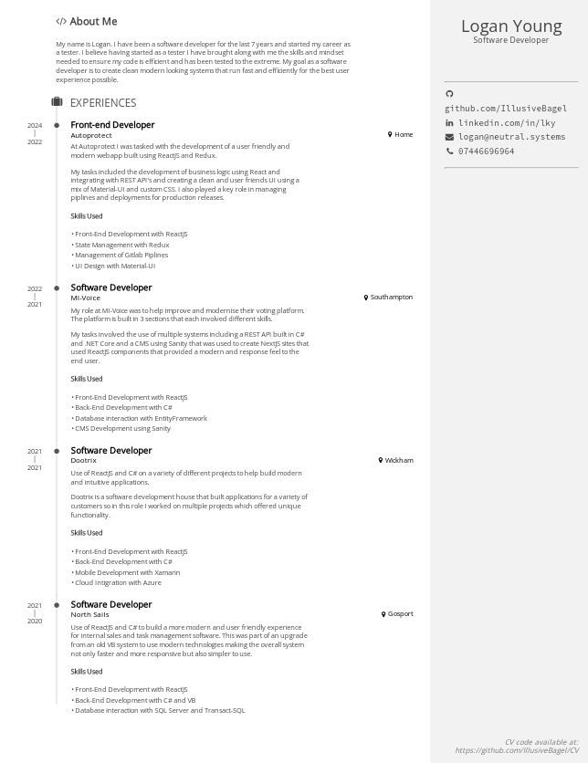

# PDF CV with Relaxed.JS (based on mnjul's design)

> Master document: [`cv.pug`](https://github.com/IllusiveBagel/CV/blob/master/cv.pug).  
> Stylesheet: [`cv.scss`](https://github.com/IllusiveBagel/CV/blob/master/cv.scss).

This CV is based on the RelaxedJS Example which can be found [Here](https://github.com/RelaxedJS/ReLaXed-examples/tree/master/examples/resume/). The RelaxedJS Example is a Conversion of mnjul's Web project which can be found [Here](https://github.com/mnjul/html-resume).

The Advantage of this system rather than using @mnjul's web project is that I can use the CV accross multiple systems and provide employers with a physical copy of the CV. This version is also a lot smaller than an entire site because it doesnt carry the weight of the JS/CSS libraries.
